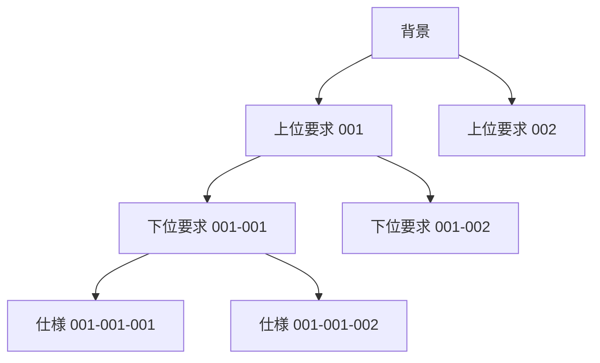
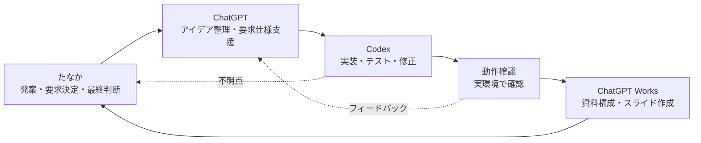

<!--
話す内容：
・アプリ名と発表の前提を共有する
・専門的な設計レビューではなく、構想と進捗紹介であることを伝える
想定説明時間：30秒
強調する点：今日は質疑応答と意見交換が主目的
-->

# USDM式 要求仕様整理まとめツール

## USDM MindMap Editor 構想紹介

<div class="subtitle">
要求・理由・仕様を、マインドマップ感覚で整理するローカルWebアプリ
</div>

---

<!--
話す内容：
・なぜ作ろうとしているのかを説明する
・表形式だけだと要求の流れや理由が追いにくい課題を示す
想定説明時間：40秒
強調する点：仕様そのものだけでなく「なぜ必要か」を追えるようにしたい
-->

## なぜ作るのか

要求仕様は、書いた後に読み返すと迷子になりやすい。

- 背景、要求、仕様の関係が見えにくい
- 「なぜその仕様が必要か」を追いにくい
- Excel中心だと構造変更や差分確認が重い
- 生成AIと一緒に仕様を育てる形式を試したい

<div class="panel">
目標：USDM式の要求整理を、視覚的でGit管理しやすい形にする
</div>

---

<!--
話す内容：
・想定ユーザーと、現時点の位置づけを説明する
・大企業向け要求管理システムではなく、個人・小規模向け試作であることを明確にする
想定説明時間：40秒
強調する点：まずは小さく使える道具として作る
-->

## 対象ユーザーと課題

<div class="two-col">

<div>

### 使ってほしい人

- 要求仕様を整理する開発者
- 個人開発者、小規模チーム
- USDMを試してみたい人
- Excel中心の管理に不便を感じる人
- 生成AIと仕様書を作りたい人

</div>

<div>

### 現時点の位置づけ

<div class="panel">
大企業向けの本格的な要求管理システムではなく、個人開発や小規模チーム向けの試作ツール。
</div>

</div>

</div>

---

<!--
話す内容：
・USDMを知らない人向けに、ざっくりした意味を説明する
・このツールではUSDMの構造をマインドマップで扱うことを伝える
想定説明時間：45秒
強調する点：要求と仕様を分け、理由を残すところがポイント
-->

## USDM MindMap Editorの概要

USDMは、要求と仕様を分けて整理し、要求の理由も残す考え方。

<div class="flow">
  <div class="node bg-node">背景</div>
  <div class="arrow">→</div>
  <div class="node req-node">上位要求</div>
  <div class="arrow">→</div>
  <div class="node req-node">下位要求</div>
  <div class="arrow">→</div>
  <div class="node spec-node">仕様</div>
</div>

<br>

- ノード追加でUSDM構造を作る
- IDは自動採番する
- ファイル実体はYAML
- Gitで差分管理しやすい形を目指す

---

<!--
話す内容：
・背景、上位要求、下位要求、仕様の木構造を説明する
・単一親でシンプルに始め、横断関係は関連リンク扱いにする方針を説明する
想定説明時間：50秒
強調する点：複数親ではなく、まず木構造として扱う
補足説明：Mermaidが使えない環境でも右側のID表で意味が伝わる
-->

## 背景・要求・仕様の構造

<div class="two-col">



<div>

### 基本方針

- 1つの背景から複数の上位要求
- 上位要求、下位要求、仕様の親は1つ
- 親子関係は木構造
- 横断的な関係は将来、関連リンクとして扱う

### ID形式

| 種別 | 例 |
|---|---|
| 上位要求 | `001` |
| 下位要求 | `001-001` |
| 仕様 | `001-001-001` |

</div>

</div>

---

<!--
話す内容：
・画面操作のイメージを説明する
・現時点では設計資料上の想定であり、実装済みではない点を明確にする
想定説明時間：45秒
強調する点：ノード追加とYAML保存・読込が中心
-->

## 画面と操作のイメージ

<div class="flow">
  <div class="node bg-node">空白 / 背景</div>
  <div class="arrow">→</div>
  <div class="node req-node">上位要求追加</div>
  <div class="arrow">→</div>
  <div class="node req-node">下位要求追加</div>
  <div class="arrow">→</div>
  <div class="node spec-node">仕様追加</div>
</div>

<br>

- ノードにはID、要求、理由、仕様を表示
- ノード間は接続線で表現
- YAMLファイルとして保存・読込
- 検索、折り畳み、Undo / Redo、各種出力は段階的に対応

<div class="small">
注：画面はマインドマップ型キャンバスを想定。実装はこれから。
</div>

---

<!--
話す内容：
・技術構成を紹介し、なぜこの構成にしたかを簡単に説明する
・細かい技術解説には入りすぎない
想定説明時間：45秒
強調する点：C#中心、ブラウザ利用、YAMLとGitとの相性
-->

## 技術構成とアーキテクチャ

<div class="two-col">

<div>

### 採用方針

- ASP.NET Core + Blazor Web App
- C# / .NET 10
- Visual Studio Code
- Git + YAML
- macOS / Apple Siliconで開発開始
- 初期段階ではDocker必須にしない

</div>

<div>

```text
Web UI
  ↓
Application Service
  ↓
Domain Model
  ↓
Persistence(YAML)
```

<div class="panel">
C#中心で作れて、ブラウザで使え、将来的な配布やテスト分離もしやすい構成。
</div>

</div>

</div>

---

<!--
話す内容：
・たなかが最終決定者で、AIは役割別に支援する関係だと説明する
・一方向ではなく、実際には往復しながら進むことを示す
想定説明時間：60秒
強調する点：AIが全部決めるのではなく、人が方針と判断を持つ
補足説明：Codexは内輪向けにはChatGPT先生の弟分くらいの軽い位置づけ。ただし公式関係ではなく比喩。
-->

## たなかと各AIの役割分担



<div class="small">
各AIは支援役。方針決定、仕様の最終判断、成果物確認はたなかが行う。
</div>

---

<!--
話す内容：
・具体日付は未確定なので、段階的な計画として説明する
・最初から全部作らず、最小実用版から育てる方針を示す
想定説明時間：60秒
強調する点：v0.1からv1.0までの成長イメージ
-->

## 開発計画と段階的リリース

| フェーズ | 内容 | リリース目安 |
|---|---|---|
| 0 構想・要求整理 | 目的、USDM構造、設計資料、Issue整理 | 現在 |
| 1 最小実用版 | Blazor、データモデル、ノード追加、YAML保存・読込 | v0.1 - v0.2 |
| 2 操作性改善 | ズーム、パン、編集、削除、Undo / Redo、検索 | v0.3 |
| 3 要求管理機能 | 関連リンク、タグ、優先度、レビュー状態、トレーサビリティ | v0.5 |
| 4 出力・共有 | Markdown、Excel、SVG / PNG / PDF、配布方法 | v1.0候補 |

<div class="small">
具体的な日付は未確定。資料上は段階的に進める計画。
</div>

---

<!--
話す内容：
・添付資料をもとに進捗を整理する
・実装済みと誤解されないよう、資料作成済みと実装未着手を分ける
想定説明時間：55秒
強調する点：現在は構想・設計資料の整理が中心
-->

## 現在の進捗

<div class="three-col">

<div class="panel">

### <span class="status-done">整理済み</span>

- 目的と基本コンセプト
- Blazor採用方針
- YAML保存方針
- 木構造と単一親
- ID形式
- Requirements / Issues

</div>

<div class="panel">

### <span class="status-doing">作業中・整理中</span>

- README
- Architecture
- UI仕様
- DataModel
- 環境構築手順
- 未解決Issueの決定

</div>

<div class="panel">

### <span class="status-todo">未着手</span>

- Blazorプロジェクト実装
- UIプロトタイプ
- YAML保存・読込機能
- テスト
- 配布

</div>

</div>

---

<!--
話す内容：
・これから決めることを提示し、質疑応答への橋渡しにする
・未決定事項を欠点ではなく、意見をもらいたいポイントとして扱う
想定説明時間：45秒
強調する点：初期版に何を入れるかが重要
-->

## 今後決めること

- YAMLスキーマバージョンの確定
- ノード削除時に子要素をどう扱うか
- 理由を必須にするか、警告にするか
- 接続線デザインと大規模データ時の表示性能
- 初期リリースに検索、Undo / Redo、出力をどこまで含めるか

<div class="panel">
ポイント：v0.1は「全部入り」ではなく、要求整理を試せる最小構成に絞る。
</div>

---

<!--
話す内容：
・質疑応答へ移る
・質問が出にくい場合の議論のきっかけを提示する
想定説明時間：30秒
強調する点：ツールの良し悪し、開発方法、初期機能について意見をもらう
-->

## 質疑応答・意見交換

議論したいこと：

- マインドマップ型の要求管理は使いやすそうか
- YAMLを保存形式にする利点と欠点は何か
- AIとの役割分担は開発方法として有効か
- 最初のリリースに最低限必要な機能は何か
